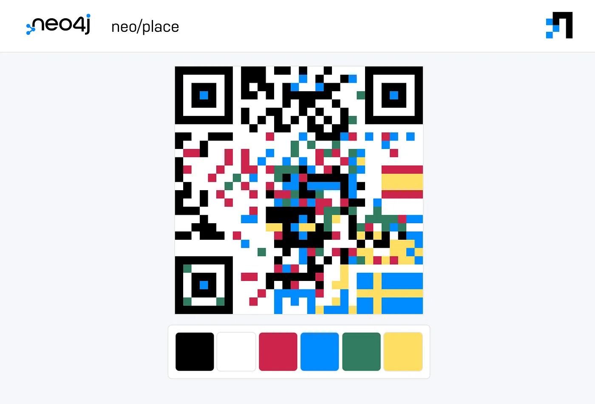
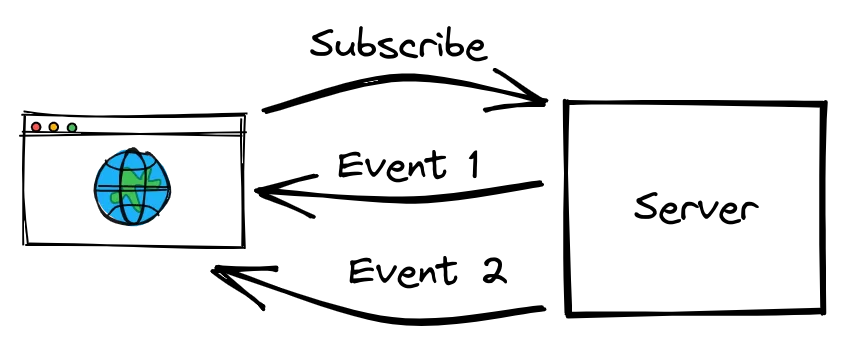
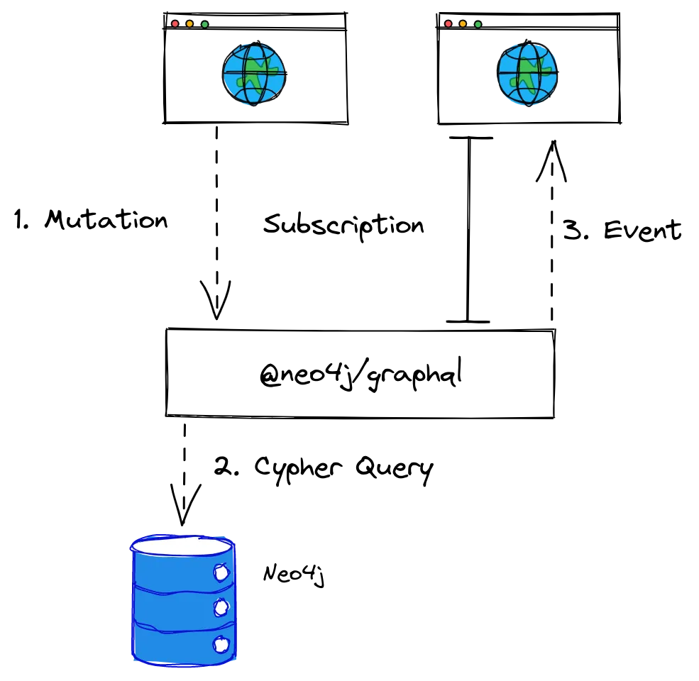
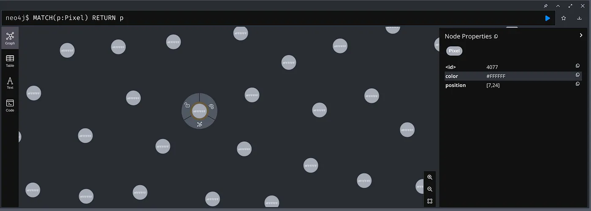
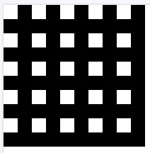
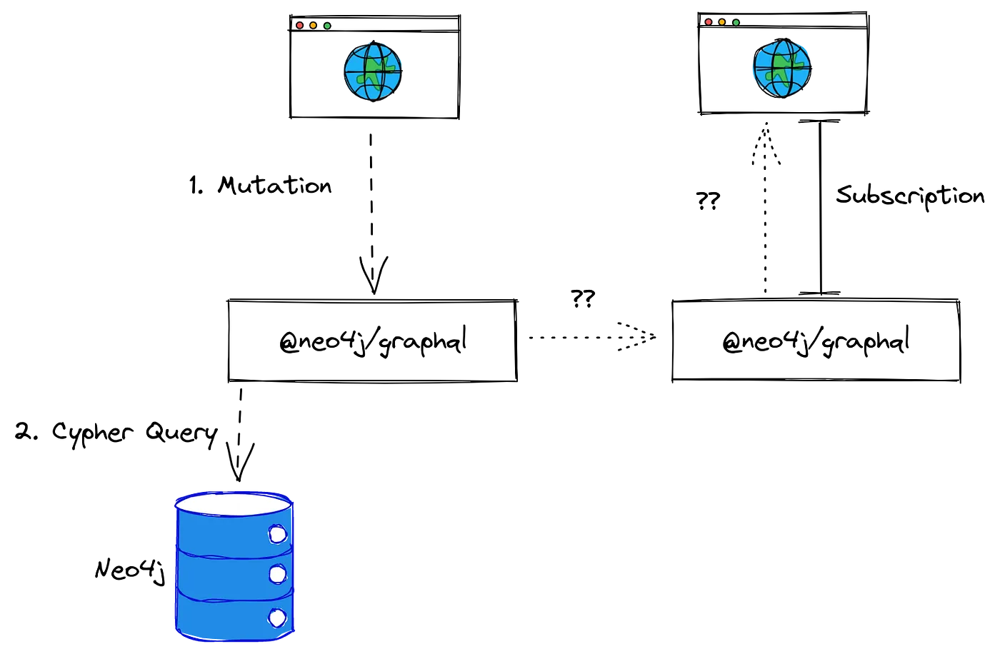
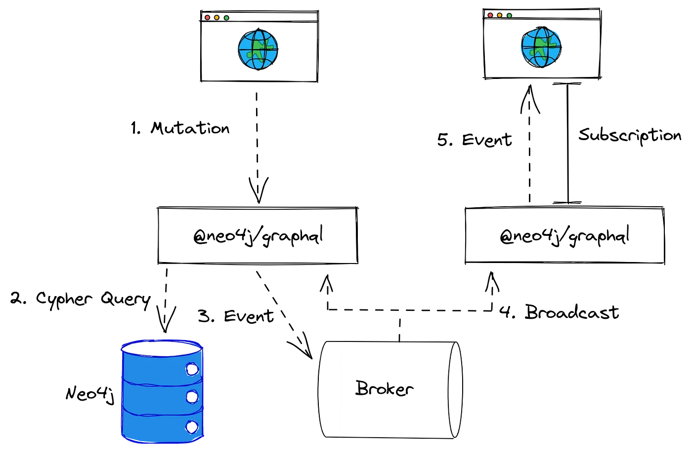

# How We Build a Clone of r/place with GraphQL

> Originally posted on [Medium](https://medium.com/neo4j/how-we-build-a-clone-of-r-place-with-graphql-c8b053b3cff9) as part of the [Neo4j Developer Blog](https://medium.com/neo4j)

> r/place was a collaborative project and social experiment hosted on [Reddit](https://www.reddit.com/) on April Fools’ Day 2017 and repeated again on April Fools’ Day 2022.
> ~ [Wikipedia](https://en.wikipedia.org/wiki/R/place)

The [GraphQL](https://neo4j.com/docs/graphql/current/) team at [Neo4j](https://medium.com/neo4j) recently released _beta_ support for [GraphQL Subscriptions](https://graphql.org/blog/subscriptions-in-graphql-and-relay) in the [@neo4j/graphql library](https://github.com/neo4j/graphql). Subscriptions allow clients to listen to changes in their Neo4j database for their real-time applications.

To showcase this feature at the 2022 [GraphConnect](https://www.graphconnect.com/) conference, we decided to build a demo, based on the famous [r/place](https://www.reddit.com/r/place), called [neo/place](https://github.com/neo4j/graphql/tree/dev/examples/neo-place).



<!-- truncate -->

This demo contains a collaborative 30x30 canvas for users to paint where all the changes are shared in real-time across all connected users through WebSockets.

Despite its simplicity, neo/place was built with scalability in mind, serving as an example of how to create a production-ready real-time service with GraphQL.

## How GraphQL Subscriptions Work

Before getting into details on how neo/place is built, it is worth seeing how GraphQL subscriptions work. At a basic level, _subscription_ operations create a long-lived connection between a client and the server. GraphQL specification does not define what mechanisms should be used for this communication — in practice, _WebSockets_ are the most common way of building subscriptions.



The following is an example of such a subscription:

```graphql
subscription {
    movieCreated {
        createdMovie {
            title
            genre
        }
    }
}
```

Just like with any other GraphQL operation, we can define the expected result. However, unlike other operations, this result is not returned as a response to the request. It will, however, be the expected format of subsequent messages sent to the client (_events_).

### How GraphQL works in [@neo4j/graphql](https://github.com/neo4j/graphql)

When using `Neo4jGraphQL`, subscriptions are an opt-in feature that, if set, will automatically create `subscription` endpoints for all entities defined in your GraphQL schema. These endpoints allow subscribing to `create`,`update`, and `delete` mutations.



These events will be triggered after a mutation to the Neo4j database.

For instance, the following type definitions:

```graphql
type Movie {
    title: String!
    genre: String
}
```

… will provide the subscriptions `movieCreated`, `movieUpdated`, and `movieDeleted` along with the common CRUD operations. This way, the following subscription:

```graphql
subscription {
    movieCreated {
        createdMovie {
            title
            genre
        }
    }
}
```

…will automatically trigger a new event whenever `createMovies` is called:

```graphql
mutation {
    createMovies(input: [{ title: "The Matrix" }]) {
        movies {
            title
        }
    }
}
```

You can find more examples and information in the [official documentation](https://neo4j.com/docs/graphql-manual/current/subscriptions).

## How neo/place Is Built

Neo/place is a simple webpage, backed by an [Apollo](https://www.apollographql.com/docs/apollo-server/) server, [@neo4j/graphql](https://github.com/neo4j/graphql) library, and a [Neo4j](https://neo4j.com/) database.

### GraphQL schema

When using `Neo4jGraphQL` both the API and the database schema are defined by a GraphQL schema. For this demo, we used the following schema:

```graphql
type Pixel @exclude(operations: [CREATE, DELETE]) {
    position: [Int!]! @readonly @unique
    color: String
}
type Query {
    canvas: [String]
        @cypher(
            statement: """
            MATCH(p:Pixel)
            WITH p.color as color
            ORDER BY p.position ASC
            RETURN collect(color) as canvas
            """
        )
        @auth(rules: [{ isAuthenticated: true }])
}
extend type Pixel @auth(rules: [{ isAuthenticated: true }])
```

The only type that we need in our database is `Pixel`, which holds the data of one pixel of our canvas:

-   _position_: An array of two integers holding the 2D coordinates of this pixel. These coordinates are unique (no two pixels can have the same position) and read-only (once the position is set, users cannot modify it)
-   _color_: The current color of that pixel, defined as a string. It will hold a hex value such as `#FF00FF`

This type is also defined with two directives that will help us secure our API:

-   `@exclude`: We will not allow users to create nor delete pixels, only update them. Exclude will remove these operations from the generated API.
-   `@auth`: Ensures only authenticated users with a valid [JWT](https://jwt.io) authentication can modify the pixels. Because this is a public app without login, the token will just contain a well-known password between client and server. This is a naive mechanism to make it slightly harder for third-party clients to consume the API but could be the base of a better security mechanism with login.

While the library provides most of the CRUD and subscription operations that we will need, for performance reasons, we are going to need a custom query as well. When loading our canvas for the first time, we need to request all pixels. If we were to use the provided CRUD operations, the query would look like this:

```graphql
query canvas {
    pixels {
        position
        color
    }
}
```

The response to this query would be something like:

```json
{
    "pixels": [
        {
            "position": [0, 0],
            "color": "#FFFFFF"
        },
        {
            "position": [0, 1],
            "color": "#FFFFFF"
        }
        // ...
    ]
}
```

This `json` format is usually okay for most queries, but in this case, we are trying to get a large number of entities (30x30 = 900 pixels), and each entity holds very little data (color and a position). So, to avoid long loading times and unnecessary networking load, we can optimize the first request by defining a custom database query with the `@cypher` directive:

```cypher
MATCH(p:Pixel)
WITH p.color as color
ORDER BY p.position ASC
RETURN collect(color) as canvas
```

This will bypass our GraphQL model and perform a [Cypher](https://neo4j.com/developer/cypher/) query directly to the database. In this example, the query will return all our pixels as an array, ordered by position and only containing the colors. The API response would look like this:

```json
{
  "canvas": ["#FFFFFF", "#FFFFFF", ...]
}
```

Thanks to the ordering by position, we can safely assume that the first item of the array will always be the pixel `[0,0]` and the last one `[29,29]`, which, as long as we know the canvas dimensions beforehand, allows us to remove redundant information and end up with a lightweight query for our first load.

### Apollo server

For our server and GraphQL runtime, we will use [Apollo](https://www.apollographql.com/docs/apollo-server/) along with [graphql-ws](https://www.npmjs.com/package/graphql-w).

We will start by loading and connecting the [Neo4j driver](https://www.npmjs.com/package/neo4j-driver) to our database:

```js
const driver = neo4j.driver(NEO4J_URL, neo4j.auth.basic(NEO4J_USER, NEO4J_PASSWORD));
```

We will also import `Neo4jGraphQL` with two plugins and pass our type definitions and the driver to the library constructor:

```js
const {
    Neo4jGraphQLSubscriptionsSingleInstancePlugin,
    Neo4jGraphQL,
} = require("[@neo4j/graphql](http://twitter.com/neo4j/graphql)");
const {
    Neo4jGraphQLAuthJWTPlugin,
} = require("[@neo4j/graphql-plugin-auth](http://twitter.com/neo4j/graphql-plugin-auth)");
const neoSchema = new Neo4jGraphQL({
    typeDefs: typeDefs,
    driver: driver,
    plugins: {
        subscriptions: new Neo4jGraphQLSubscriptionsSingleInstancePlugin(),
        auth: new Neo4jGraphQLAuthJWTPlugin({
            secret: "super-secret42",
        }),
    },
});
```

The two plugins that we are importing are official plugins to enhance the capabilities of `Neo4jGraphQL`:

-   `Neo4jGraphQLSubscriptionsSingleInstancePlugin` to enable subscriptions.
-   `Neo4jGraphQLAuthJWTPlugin` to enable JWT authentication with the `@auth` directive.

Once everything is set, we can build our schema to have a complete GraphQL API, ready to be served by Apollo:

```js
const schema = await neoSchema.getSchema();
await neoSchema.assertIndexesAndConstraints({
    options: {
        create: true,
    },
});
```

This code will also ensure that `@unique` constraints are properly set in the database for consistency and performance with `assertIndexesAndConstraints`.

Finally, we need to pass this schema to an Apollo server:

```js
const server = new ApolloServer({
    schema,
    context: ({ req }) => ({ req }),
});
```

> For the full working example, refer to [https://github.com/neo4j/graphql/tree/dev/examples/neo-place](https://github.com/neo4j/graphql/tree/dev/examples/neo-place)

### Database model

We will be using a Neo4j Graph database — this means that our pixels will be modeled as “Nodes” in a graph in our database.

As mentioned before, we will have a static set of pixels that users can modify, but cannot create nor delete. We need to populate the database when the server starts. To achieve this, we will simply perform a Cypher query directly from the Neo4j driver:

```js
const session = driver.session();
await session.run(`
  UNWIND range(0, 29) AS x
  UNWIND range(0, 29) AS y
  MERGE(p:Pixel { position: [x, y]})
  ON CREATE SET p.color="#FFFFFF"
`);
await session.close();
```

This query will create new entities, with positions from `[0,0]` to `[29, 29]` and a default white (`#FFFFFF`) color. By using `MERGE` we will only create the entities if these do not exist already.



> For this demo, we are running a [Neo4j AuraDB Free](https://neo4j.com/cloud/platform/aura-graph-database), so all the hosting and managing was done for us in the cloud.

## Building neo/place Client

Our client will consist of a plain HTML webpage with a `<canvas>` element that will display our collaborative drawing, and some buttons to select colors.

```html
<canvas id="place" height="300px" width="300px"></canvas
><button class="color-button" style="background-color: rgb(204, 37, 75);"></button>
<button class="color-button" style="background-color: rgb(1, 139, 255);"></button>
<!-- .... -->
```

### Connecting to our server

To fulfill neo/place needs, we will only need three GraphQL queries to our server. To perform these queries we decided to use the GraphQL client [urql](https://www.npmjs.com/package/urql) along with [graphql-ws](https://www.npmjs.com/package/graphql-ws).

We will begin by creating a simple wrapper over our server API.

First, we need to call our custom `canvas` endpoint, which we will use to render the canvas at the beginning:

```js
async getCanvas() {
  const canvasQuery = gql`
    query Canvas {
      canvas
    }
  `;
  const result = await this.client // urql client
    .query(canvasQuery)
    .toPromise()
  if (result.error) throw new Error(result.error.message)
  return result.data.canvas
}
```

This method will return the array of colors that we will use later to fill the canvas.

We also need to listen to our server events whenever a pixel is modified. We will do this through a `subscription` query hooked to a callback on every event received:

```js
onPixelUpdate(cb) {
  const pixelsSubscription = gql`
    subscription Subscription {
      pixelUpdated {
        updatedPixel {
          position
          color
        }
      }
    }
  `;

  pipe(
  this.client.subscription(pixelsSubscription), // urql client
  subscribe((result) => {
   if (!result.error) {
    cb(result.data.pixelUpdated)
   }
  })
 );
}
```

Finally, we need to update a pixel in the database whenever the user clicks on it:

```js
updatePixel(position, color) {
  const updatePixelQuery = gql`
    mutation UpdatePixels($update: PixelUpdateInput, $where: PixelWhere) {
      updatePixels(update: $update, where: $where) {
        pixels {
          position
          color
        }
      }
    }
 `;
  const params = {
    update: {
      color
    },
    where: {
      position
    },
  };  return this.client.mutation(updatePixelQuery, params).toPromise();
}
```

### Interacting with the canvas

Our canvas is a static 300x300 pixels canvas on our screen. However, we want to display a 30x30 grid on it. Each one of our “pixels” will be rendered as a 10x10 tile that users can draw with a single color.



Like with our API, we will create a few helper methods to handle canvas interaction.

First, we need to be able to draw a pixel as a 10x10 tile:

```js
function drawPixel(pixel, color) {
    const ctx = canvas.getContext("2d");
    const x0 = pixel[0] * 10;
    const y0 = pixel[1] * 10;

    ctx.fillStyle = color;
    // We don't want our browser to smooth our pixels
    ctx.imageSmoothingEnabled = false; // Paint a rectangle of 10x10 in the given coordinates
    ctx.fillRect(x0, y0, 10, 10);
}
```

We also need to listen for a pixel being clicked by the user:

```js
function onPixelClicked(cb) {
    canvas.addEventListener(
        "click",
        (ev) => {
            const screenPixel = [ev.clientX, ev.clientY];
            const rect = canvas.getBoundingClientRect();

            const x = screenPixel[0] - parseInt(rect.left);
            const y = screenPixel[1] - parseInt(rect.top);

            const pixelClicked = [parseInt(x / 10), parseInt(y / 10)]; // Calls the callback to handle interaction with the API
            cb(pixelClicked);
        },
        false
    );
}
```

### Wiring everything together

With these two helpers, we can easily hook our canvas interactions to our API and propagate any changes received by the subscription to the canvas.

Draw canvas on the first request:

```js
// Receives the array with all the canvas colors
const canvasColors = await serverApi.getCanvas();
let i = 0,
    j = 0;
for (const pixelColor of canvasColors) {
    drawPixel([i, j], pixelColor);
    j++;
    if (j === 30) {
        // new line in the canvas
        i++;
        j = 0;
    }
}
```

We need to update the canvas whenever we receive a subscription event:

```js
serverApi.onPixelUpdate((updatedEvent) => {
    const updatedPixel = updatedEvent.updatedPixel;
    drawPixel(updatedPixel.position, updatedPixel.color);
});
```

Finally, we need to notify the server whenever the user updates the canvas:

```js
let selectedColor = "#FF0000"onPixelClicked((pixelClicked) => {
  // Draw pixel immediately to provide instant feedback to the user
  drawPixel(pixelClicked, selectedColor);
  // Updates pixel in the database
  serverApi.updatePixel(pixelClicked, selectedColor);
});
```

> For the complete code example, including race conditions and errors handling, check the example at https://github.com/neo4j/graphql/tree/3.x/examples/neo-place/client

## Horizontal Scaling

As mentioned, the demo is relatively simple with not too much code involved, but we also promised this will showcase a production-ready setup that scales horizontally. We will see what changes are required in the different systems of this demo to scale it.

### Database

Because we are using the cloud-hosted [AuraDB](https://neo4j.com/cloud/platform/aura-graph-database/), scaling the database would be as simple as switching to a higher tier. However, because subscriptions are designed in a way that will not produce extra queries or overhead to the database, the database only needs to worry about the relatively simple queries and mutations we are executing.

This means that, even under a heavy load, all of our queries are simple property updates over indexed nodes (the `@unique` constraint over positions that we already set acts as index). Even in the free tier, we would need a high load to hit a performance limit in the database, so we will stick to the free instance for now.

### Server and AppEngine

To host our Node.js server with Apollo, we decided to deploy them to Google cloud [AppEngine](https://cloud.google.com/appengine). This ensures that the server itself will scale according to the load. AppEngine will take care of load balancing (including WebSocket connections) and automatic scaling, so no extra work is needed on this front on our side.

### Scaling subscriptions with AMQP

Subscriptions, like any WebSockets service, are traditionally hard to scale. While a client may be subscribed to a certain instance, a mutation may happen in a completely separate instance that may not know about that subscription.



Sadly, this problem is not something that load balancers or AppEngine will solve for us. Having our clients subscribe to all servers or use a single instance to handle all subscriptions would defeat the purpose of scaling the server.

One of the most elegant solutions to this problem is to use a separate broker, such as [Redis](https://redis.io/) or [RabbitMQ](https://www.rabbitmq.com/), to efficiently handle and broadcast messages across all our instances:



This means, that each instance has two jobs regarding subscriptions:

1.  Notify the broker whenever a mutation happens.
2.  Listen to the broker, and route these events to its subscribed clients.

Additionally, `Neo4jGraphQL` will take care of filtering and authentication of the messages received by the broker before sending them to the client.

While all of this may sound like a lot of work, `Neo4jGraphQL` is designed with this architecture in mind. That means we only need to do two changes to the system to achieve horizontal scalable subscriptions:

**1. Setup an AMQP server (e.g RabbitMQ)**.
We could host our own, but for this demo we decided, as with everything else, to leave that to a cloud-hosted service: [CloudAMQP](https://www.cloudamqp.com/). In its free tier, we are limited by queue size, connections, and total messages sent.

For this use case, queue size and connections are not a problem, as we are running a real-time service, connected only by our server instances and without message persistence. Maximum messages and messages per second will be our limiting factors, but, as with all other services described, this can easily be increased by moving to higher tiers if needed.

**2. Configure Neo4jGraphQL to use RabbitMQ.**
The plugin system on which subscriptions are built is designed with brokers in mind — we have already seen how to use a plugin: `Neo4jGraphQLSubscriptionsSingleInstancePlugin`— which, as the name implies, is intended to be used for single instance servers. Setting an AMQP broker instead is as simple as using `[Neo4jGraphQLSubscriptionsAMQPPlugin](https://www.npmjs.com/package/@neo4j/graphql-plugin-subscriptions-amqp)` instead:

```js
const { Neo4jGraphQLSubscriptionsAMQPPlugin } = require("@neo4j/graphql-plugin-subscriptions-amqp");
// ...
plugins: {
  subscriptions: new Neo4jGraphQLSubscriptionsAMQPPlugin({
   connection: AMQP_URL
  });
 },
// ...
```

`Neo4jGraphQLSubscriptionsAMQPPlugin` is one of the officially supported plugins for subscriptions with `Neo4jGraphQL`, but it is also possible, albeit with a little more work, to create your own plugins for any suitable broker. And just like that, we already have a scalable, production-ready demo. Of course, we didn’t want to test it live…

## Bonus: Testing Scale on neo/place

We started by manually testing how neo/place behaved by sharing the demo with colleagues, but we wanted to make sure that our humble demo could handle roughly 500 concurrent users painting at the same time (we are optimists).

Testing this kind of load is not trivial for a real-time service. Blindly sending lots of requests to the server will not provide a realistic load of multiple simultaneous connections. We needed proper, end-to-end, realistic interactions.

### Automated browsers

Headless browsers are a great way to emulate real users, helping us validate that the system works as expected under a heavy load in a realistic environment. For this simple test, we opted to use the famous [Puppeteer](https://github.com/puppeteer/puppeteer) headless browser along with the [wendigo](https://github.com/angrykoala/wendigo) wrapper that provides some useful features to make it easier to use.

The resulting code to achieve these interactions (a simple `.js` script) is surprisingly simple:

```js
const browser = await Wendigo.createBrowser();
await browser.open("neo-place-url"); // Forces display, regardless of environment
await browser.setViewport({
    width: 500,
}); // Waits for canvas to be visible
await browser.waitFor("#place", 2000); // Get canvas boundaries
const bounds = await browser.evaluate(() => {
    const canvas = document.querySelector("#place");
    const bounds = canvas.getBoundingClientRect();
    return {
        top: bounds.top,
        bottom: bounds.bottom,
        right: bounds.right,
        left: bounds.left,
    };
}); // Draw a random pixel with a random color every 100ms
setInterval(async () => {
    const randomColor = getRandomInRange(0, 5); // Clicks a random color button
    await browser.click(".color-button", 1); // Gets a random pixel within the canvas
    const coords = getRandomCoordinates(bounds);
    await browser.click(coords[0], coords[1]);
}, 100);
```

And just for completeness, the two helper functions to get random buttons and pixels:

```js
function getRandomInRange(from, to) {
    return (Math.random() * (to - from) + from).toFixed(0) * 1;
}
function getRandomCoordinates(bounds) {
    const x = getRandomInRange(bounds.left, bounds.right);
    const y = getRandomInRange(bounds.top, bounds.bottom);
    return [x, y];
}
```

With this bot in our hands, we can emulate a new pixel being drawn every 100ms — way faster than any normal user could. Now, by running a bunch of these headless browsers (we used [pm2](https://pm2.keymetrics.io/)) across a few computers we could get some rough estimates on how many users the system could hold. With this setup, one bot is roughly equivalent to 10 concurrent users, in terms of load to the system.

If you are interested in building GraphQL APIs, backed by a graph database, check [@neo4j/graphql](https://github.com/neo4j/graphql), the official [documentation](https://neo4j.com/docs/graphql-manual/current), and click [here](https://neo4j.com/docs/graphql-manual/current/subscriptions/) to learn more about subscriptions with Neo4j.

This project is based on [r/place](https://www.reddit.com/r/place/). To get more information about how the actual place was built, check the fantastic post [How We Built r/Place](https://www.redditinc.com/blog/how-we-built-rplace/).
