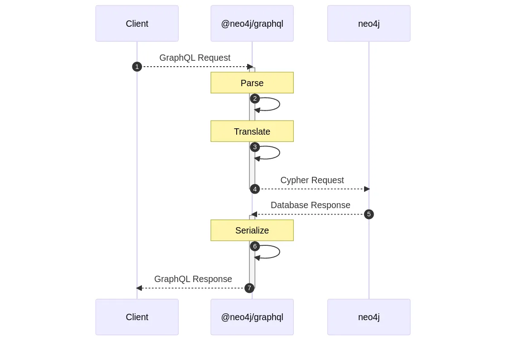
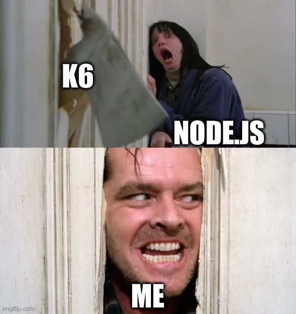
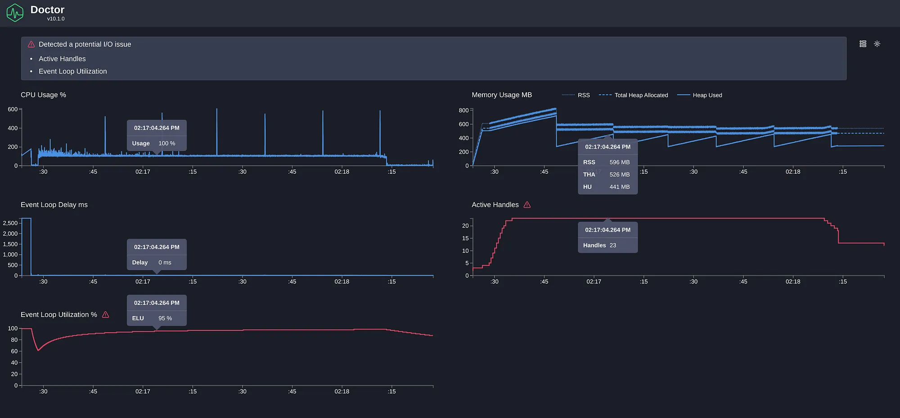
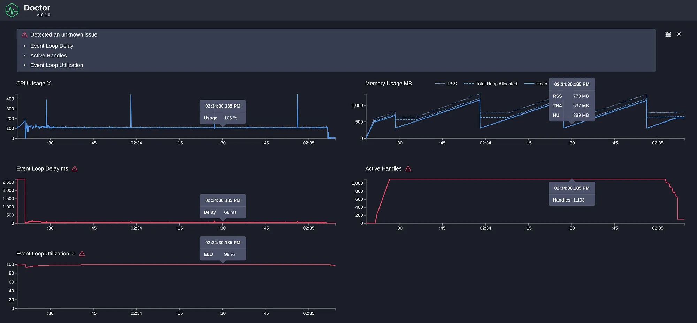
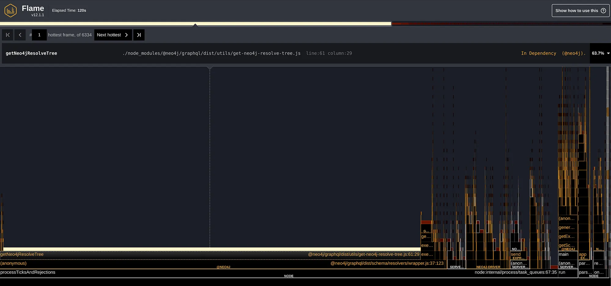
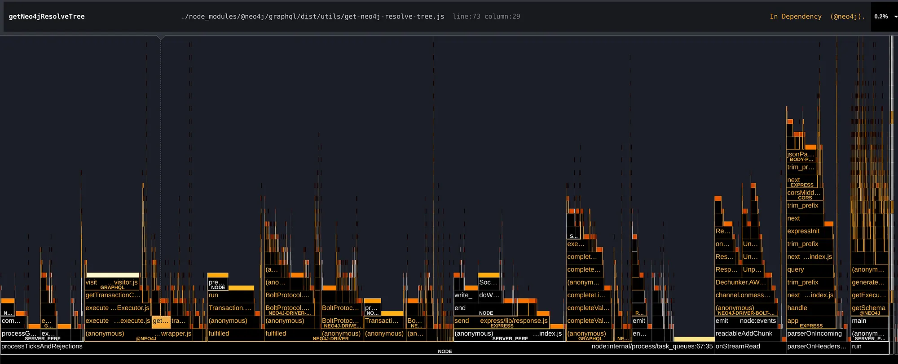
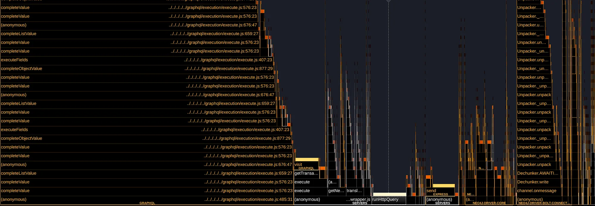

# Improving a Node.js GraphQL Server Performance

> Originally posted on [Medium](https://medium.com/neo4j/improving-a-node-js-graphql-server-performance-645a4ae711c3) as part of the [Neo4j Developer Blog](https://medium.com/neo4j)

In the GraphQL team of Neo4j, we’ve had some reports of poor performance of the [`@neo4j/graphql`](https://www.npmjs.com/package/@neo4j/graphql) library. In this post, I’ll briefly discuss the tools and processes we used to identify and fix some of the performance problems in a Node.js server for GraphQL.

<!-- truncate-->


[`@neo4j/graphql`](https://www.npmjs.com/package/@neo4j/graphql) is a Node.js library that attaches to a GraphQL server such as [Apollo](https://www.apollographql.com/) or [Yoga](https://the-guild.dev/graphql/yoga-server) and automatically generates a GraphQL API that connects to our Neo4j database.

The following is a high-level diagram of how the library works:



When a request comes to the server, `@neo4j/graphql` translates that request into a Cypher query and sends it to the database. The _parse_ and _serialize_ steps are mainly done by the server, such as Apollo, to which the library is attached.

In any given request, most of the time is spent in the database, and the server would keep resolving other requests while waiting for a database response, thanks to the asynchronous nature of Node.js.

Our earlier focus on performance has been to optimize the Cypher query sent to the database, and this is something we continue to do. However, we received feedback on poor performance specifically relating to the server, where when using the library, only a few requests could be fulfilled per second.

That meant we had to start focusing on the actual library performance, to make sure that it was not the bottleneck. The prime suspect was the **translation layer**, as this is the bulk of the library and performs a lot of synchronous JavaScript code processing the GraphQL query and generating Cypher queries.

## Measuring

Even if we have a prime suspect for these problems, we first need to measure, so we can answer these questions:

-   Is there a performance problem?
-   What is the cause of the performance problem?
-   Once we propose a solution. Is it really fixing the problem?

### Server Benchmark

The first step was to build a simple server that allows us to validate the problems and their fix:

```js title="server.js"
import { ApolloServer } from "@apollo/server";
import { startStandaloneServer } from "@apollo/server/standalone";
import neo4j from "neo4j-driver";
import { Neo4jGraphQL } from "@neo4j/graphql";
import { getSchema } from "../typedefs.js"; // Test GraphQL Schema
const driver = neo4j.driver("bolt://localhost:7687", neo4j.auth.basic("neo4j", "password"), {
    maxConnectionPoolSize: 100,
});
const neoSchema = new Neo4jGraphQL({
    typeDefs: getSchema(),
    driver,
});
const schema = await neoSchema.getSchema();
await neoSchema.assertIndexesAndConstraints({ options: { create: true } });
const server = new ApolloServer({
    schema,
});
const { url } = await startStandaloneServer(server, {
    context: async ({ req }) => ({ token: req.headers.token }),
    listen: { port: 4000 },
});
console.log(`🚀 Server ready at ${url}`);
```

To learn more about this server and `@neo4j/graphql` check the [documentation](https://neo4j.com/docs/graphql-manual/current/getting-started/). This example is running `@neo4j/graphql: 3.18.2`

Along with this server, I’m running a local Neo4j database with a bunch of dummy data. The `getSchema` function returns a large GraphQL schema, trying to replicate a real server schema.

For now, I will be running this server with `node server.js`, which means it will be running on a single thread.

### Load Testing With K6

To test this server, we will be using [Grafana K6](https://k6.io/), a load-testing tool, to send requests to our server.

K6 uses Virtual Users (VUs), which are processes running on a loop to perform requests. Note that, with this configuration, the number of VUs does not match the number of real users that could be handled by the server, as these are sending requests as quickly as possible, instead of behaving as real users, who would send requests more sporadically.

> Note that it is possible to mimic real user behaviour with K6, which could yield more accurate metrics, but for now we are only trying to test our server under stress.

All of the K6 configurations are done through a script. First, we set up the basic configuration of K6 by exporting the `options` object:

```js title="load.js"
import http from "k6/http";
import { check } from "k6";
const MAX_VUS = 10;
export const options = {
    scenarios: {
        default: {
            executor: "ramping-vus",
            stages: [
                { duration: "5s", target: MAX_VUS }, // Ramp up
                { duration: "90s", target: MAX_VUS },
                { duration: "10s", target: 0 }, // Cooldown
            ],
        },
    },
};
```

In this setup, we define a single [scenario](https://k6.io/docs/using-k6/scenarios/) in which we will run 10 VUs for 90 seconds. We also define 5 seconds of ramping up and 10 seconds of cooldown to make sure any dangling request is fulfilled.

Then, we define the GraphQL query to be used and some configuration through the `setup()` function:

```js
export function setup() {
    return {
        query: `
          query SimpleQuery {
              movies(options: { limit: 10 }) {
                  title
              }
          }`,
        headers: {
            "Content-Type": "application/json",
        },
    };
}
```

This function is executed once at the beginning and allows us to perform some setup that will be passed down to each VU.

Finally, the exported `default` function will run on each VU process, executing in a loop. This function receives the config object that we returned in `setup()`:

```js
export default function (config) {
    const res = http.post("http://localhost:4000/graphql", JSON.stringify({ query: config.query }), {
        headers: config.headers,
    });
    const body = JSON.parse(res.body);
    check(res, {
        "status was 200": (r) => r.status == 200,
        "response has body": (r) => r.body,
        "response has data": () => body && body.data,
        "response has no error": () => {
            if (body && body.errors && body.errors.length > 0) {
                console.error(body.errors);
                return false;
            }
            return true;
        },
    });
}
```

We first use the `http` object imported from K6 to perform the requests, all the data regarding this will automatically be gathered and returned at the end by K6.

Then, we get the response body, parse it, and perform some checks with K6’s `check` function, which lets us validate if the response is correct or not.

Because we are performing GraphQL requests, we need to manually validate that the returned object does not contain an `"errors"` field. This lets us know if our query is incorrect or if the requests have made the server fail somehow.

We are finally ready to run our benchmark:

```
node server.js
```

```
k6 run load.js
```



After a while, we get the final K6 report:

```
scenarios: (100.00%) 1 scenario, 10 max VUs, 2m15s max duration (incl. graceful stop): \* default: Up to 10 looping VUs for 1m45s over 3 stages (gracefulRampDown: 30s, gracefulStop: 30s)
✓ status was 200
✓ response has body
✓ response has data
✓ response has no error
█ setup
checks.........................: 100.00% ✓ 200624 ✗ 0
 data_received..................: 30 MB 287 kB/s
data_sent......................: 12 MB 113 kB/s
http_req_blocked...............: avg=1.14µs min=457ns med=961ns max=194.43µs p(90)=1.52µs p(95)=1.84µs
http_req_connecting............: avg=17ns min=0s med=0s max=141.24µs p(90)=0s p(95)=0s
 http_req_duration..............: avg=19.45ms min=2ms med=19.31ms max=55.6ms p(90)=24.08ms p(95)=24.79ms
{ expected_response:true }...: avg=19.45ms min=2ms med=19.31ms max=55.6ms p(90)=24.08ms p(95)=24.79ms
http_req_failed................: 0.00% ✓ 0 ✗ 50156
http_req_receiving.............: avg=22.05µs min=7.37µs med=19.3µs max=372.04µs p(90)=34.6µs p(95)=41.57µs
http_req_sending...............: avg=6.98µs min=2.93µs med=6.18µs max=240.09µs p(90)=9.7µs p(95)=12.65µs
http_req_tls_handshaking.......: avg=0s min=0s med=0s max=0s p(90)=0s p(95)=0s
 http_req_waiting...............: avg=19.42ms min=1.98ms med=19.28ms max=55.56ms p(90)=24.06ms p(95)=24.76ms
http_reqs......................: 50156 477.671271/s
iteration_duration.............: avg=19.53ms min=1.77µs med=19.39ms max=55.83ms p(90)=24.17ms p(95)=24.88ms
iterations.....................: 50156 477.671271/s
vus............................: 1 min=1 max=10
vus_max........................: 10 min=10 max=10
running (1m45.0s), 00/10 VUs, 50156 complete and 0 interrupted iterations
```

In the K6 report, we get a breakdown of request times and a list of the checks that we defined.

We will be focusing only on the following metrics for now:

-   `http_reqs: 50156 477.671271/s`
-   `http_req_duration: p(90)=24.08ms`

For the total HTTP requests count, we care about both the absolute number and the number of requests fulfilled per second. For the duration, we will focus on the percentile 90 value.

For all the measurements that we will take to compare, it is important to run the benchmark at least twice and average the values to ensure consistent results.

> Note that I’m running K6 locally along with my server and database. The absolute value of requests completed is not really a useful metric, as it is dependant on my current setup, but it will be useful for comparisons under the same conditions.

### More Complex Query

Now that we have the benchmark, we need to ensure that we are not only testing a simple query but also a more realistic example. To do it, we will use the following query:

```graphql
query highComplexityQueryWithLimit {
    movies(options: { sort: { title: DESC }, limit: 10 }) {
        released
        tagline
        title
        actors(options: { sort: { name: DESC }, limit: 2 }) {
            name
            movies(options: { sort: { title: DESC }, limit: 2 }) {
                released
                tagline
                title
                actors(options: { sort: { name: DESC }, limit: 2 }) {
                    name
                    movies(options: { sort: { title: DESC }, limit: 2 }) {
                        released
                        tagline
                        title
                    }
                }
            }
        }
    }
}
```

With this query, we exercise a scenario in which the database will need some time to compute the query, the GraphQL parser and the library will have to deal with nested fields and a lot more data will be returned for the server to process.

Running both scenarios:

```
| Query   | Requests | Request Duration P(90) |
| ------- | -------- | ---------------------- |
| Simple  | 50156    | 24.08ms                |
| Complex | 24275    | 48.17ms                |
```

These results are to be expected, as the high complexity query takes significantly longer to complete in the database, plus the overhead on the returned data parsing.

### Clinic.js Doctor

The next step is to figure out if the server is acting as a bottleneck, and for this, we will use [Clinic.js](https://clinicjs.org/). A set of tools to inspect a Node.js application, providing a lot of interesting insights. We will begin with **Clinic.js** **Doctor.**

We first need to install Clinic.js:

```
npm install -g clinic

```

Then, we execute our server with Clinic.js doctor wrapper:

```

clinic doctor --on-port -- node server.js

```

This will execute our server normally, so we can then run K6 as before. After closing our server, Clinic.js Doctor will show the analysis results in the browser:



There are a few metrics provided by Clinic Doctor with some interesting insights to consider here:

-   CPU: It mostly stays at 100%, which is normal for a single thread under stress load testing. We can see spikes of CPU matching the memory peaks, which indicates it is the garbage collector.
-   Memory: It jumps between ~200MB and ~800MB. The server definitely has a big memory footprint, but there doesn’t seem to be a memory leak problem as the memory stays on that range.
-   Event Loop Delay: This is one of the most important metrics. It measures the delay of the event loop, which may indicate blocking code in the server. The initial bump is the server setup, and we can ignore it. After that, it looks to be stable at ~0ms.
-   Active Handles: We can see that the active handles increase with the number of VUs, which is expected. There are also extra handles for the connections to the Database.
-   Event Loop Utilization: This shows high event Loop utilization (>95%) and could be a hint that there is a problem

> Note that the K6 metrics are affected by Clinic.js Doctor, so these need to be measured separately.

### Increase VUs

The High event loop utilization hints at a problem. If the event loop is blocking the thread, it may be causing the requests to be blocked by each other while processing, causing a cascade effect.

To expose this problem, we will increase the VUs of the load to 1000:



Here we can see the following changes compared to 10 VUs:

-   Memory has increased noticeably, but it still stays constant over time.
-   Active handles have increased to 1103, while this may hint at a problem, as we are only running 1000 concurrent requests. After some investigation, we can see the extra 100 handles are the connection pool to the Database, so, again, this doesn’t seem to be a problem.
-   Event Loop delay and utilization increment: Again, ignoring the initial bump (that’s a problem for another day), we can see an increase to 66ms. Not too surprising, as we are running 1000 concurrent requests on a single thread, but enough to be affecting our throughput.

These analyses show that we seem to have some bottleneck in our JavaScript code, now we need to fully validate that and answer the follow-up question: _Where is this problem?_

### Flamegraph

We now have a couple of hints that our translation layer is causing a delay in the Node.js thread. To try to identify the exact culprit of this, we are going to make use of Clinic.js Flame, a flamegraph generation tool. You can read more about flamegraph visualization in [Clinic.js](https://clinicjs.org/documentation/flame/04-flamegraphs/) docs.

We can run it with:

```
clinic flame -- node server.js
```

And then run our K6 load script with 1000 VUs:



Ok, what’s going on here? In a nutshell, the flame graph has time in the X-axis, whilst the “flames” are the functions being called. “Hot Functions” are functions that stay on the top of the stack for a long time, hinting that those may be key code to optimize.

So, in this mess of squares, where is our translation code that is probably causing the problem? Well…


That little red circle surrounds the function `translateRead`, which is the code that translates queries, and such, our main business logic. However, it doesn’t seem to be taking much time. It barely represents 0.7% of the total time spent in the flamegraph!

Another insight we find is the function `getNeo4jResolveTree` , which, according to the flamegraph, seems to be executing for more than half of the time.

## Fixing the Code

It is not too important what this function does for this blog post, but it is notable that it only executes once at the beginning of a request and has barely any business logic, making a surprising discovery that it takes a whopping 63% of the execution time.

After carefully reading through this function, we can easily spot the problem:

```ts
const queryType = resolveInfo.schema.getQueryType();
const mutationType = resolveInfo.schema.getMutationType();
const subscriptionType = resolveInfo.schema.getSubscriptionType();
field = Object.values({
    ...queryType?.getFields(),
    ...mutationType?.getFields(),
    ...subscriptionType?.getFields(),
}).find((f) => f.name === resolveTree.name);
```

This code may look somewhat innocent, other than the linear `find`. The problem, however, is simply that the three variables are big objects containing the schema data, and destructuring and composing them back into an object causes a big block of the execution thread.

The fix proposed is quite simple:

```ts
const queryType = schema.getQueryType();
const mutationType = schema.getMutationType();
const subscriptionType = schema.getSubscriptionType();
const queryFields = queryType?.getFields()[fieldName];
const mutationFields = mutationType?.getFields()[fieldName];
const subscriptionFields = subscriptionType?.getFields()[fieldName];
const field = queryFields || mutationFields || subscriptionFields;
return field;
```

And no, this is not a particularly elegant code. It is not even a particularly efficient code, as we could be caching the fields, so we are only doing a single lookup instead of 3.

However, by measuring again, we can see that any further performance improvements here would be futile, as any bottleneck is no longer in this part of the codebase.



Thanks to the flamegraphs, we were able to confirm there was a problem, and, more importantly, find where. This was particularly important, as the actual performance issue was not where we first thought.

## Measure Again

We are not done yet. We have definitely fixed a problem with our codebase, but we need to validate that this has a real effect on our server and users. Here is where all of our initial setup comes in handy. Now we can patch the code and run the same queries again to compare:

```
| Query            | Requests       | Request Duration P(90) |
| ---------------- | -------------- | ---------------------- |
| Simple (Before)  | 50156          | 24.08ms                |
| Complex (Before) | 24275          | 48.17ms                |
| Simple (After)   | 180022 (+258%) | 6.97ms                 |
| Complex (After)  | 37940 (+56%)   | 30.6ms                 |
```

We can see that, for this benchmark, the simple queries (which can easily be handled by the database and were limited by the server) have increased dramatically, whilst the complex queries, which are much more intense for the database, have only increased by a respectable 56%.


> For users of the `_@neo4j/graphql_` library, these performance improvements are available in `_@neo4j/graphql: 3.19.0_`_. More thorough metrics can be found_ [_here_](https://github.com/neo4j/graphql/issues/3304)

## More Measurements!

As part of this research, we did a lot of measurements, trying different variables and tools. Most of these ended up in nothing, but we found a few other interesting insights after the `getNeo4jResolveTree` problem was fixed by applying the same methodology and tools:

### Another Hot Code

By following the trail of the flamegraphs, another seemingly innocent piece of code was also causing some bottlenecks in our server:

```
query: print(info.operation),
```

A simple logging print of the GraphQL AST that was done on every execution was causing another performance detriment, patching it gave us another small improvement in the overall performance of ~5%:

```
| Query           | Requests      | Request Duration P(90) |
| --------------- | ------------- | ---------------------- |
| Simple (Fix 1)  | 180022        | 6.97ms                 |
| Complex (Fix 1) | 37940         | 30.6ms                 |
| Simple (Fix 2)  | 194558 (+8%)  | 6.57ms                 |
| Complex (Fix 2) | 40028 (+5.5%) | 29.26ms                |
```

### Yoga vs. Apollo

Another surprising finding of the flamegraph was the overhead that a GraphQL parser poses on a server when returning a lot of data:



The `@neo4j/graphql` library is designed to work with any GraphQL server, but seeing how GraphQL itself may have an impact, and taking advantage of our tooling, we ran some benchmarks of how our library works with 2 of the most famous GraphQL servers: Apollo and Yoga

To perform this benchmark, we used the same server and queries as described in this post and a simple yoga server with the same behavior (All of this setup can be seen [here](https://github.com/neo4j/graphql/tree/dev/packages/graphql/tests/performance/server)).

K6 was set to run for 1m45s with 10VUs on a local server with a local database.

We’ve also used [PM2](https://www.npmjs.com/package/pm2) to use multiple instances to validate the behavior on multi-thread. Note that every case was run twice and averaged:

```
| Server | Instances | Query               | Requests Fulfilled | Duration P(90) | Req/s |
| ------ | --------- | ------------------- | ------------------ | -------------- | ----- |
| Apollo | 1         | SimpleQuery         | 207678             | 5.74ms         | 1978  |
| Yoga   | 1         | SimpleQuery         | 259298 (+24.8%)    | 4.65ms         | 2469  |
| Apollo | 2         | SimpleQuery         | 372906             | 3.28ms         | 3551  |
| Yoga   | 2         | SimpleQuery         | 452440 (+21.3%)    | 2.74ms         | 4309  |
| Apollo | 4         | SimpleQuery         | 533150             | 2.33ms         | 5077  |
| Yoga   | 4         | SimpleQuery         | 612692 (+14.9%)    | 1.9ms          | 5835  |
| Apollo | 1         | HighComplexityQuery | 42653              | 27.3ms         | 406   |
| Yoga   | 1         | HighComplexityQuery | 61330 (+44%)       | 19.3ms         | 584   |
```

In every test case we have run (including those not present in this post), we consistently found a performance improvement using Yoga with our library, usually hovering around +20%, in the number of requests fulfilled.

These numbers, of course, will depend widely on the particular setup and deployment (these measurements were only done on a local setup), even more so if using complex GraphQL features for which one server or the other may be more apt. But it shows how measuring can have a real impact on your server performance.
